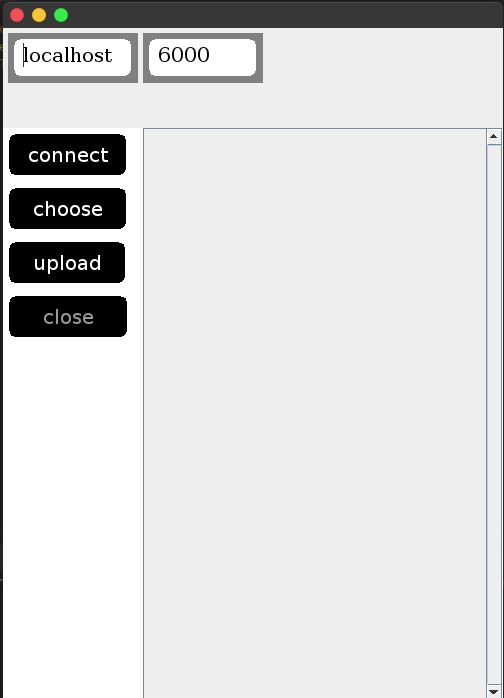
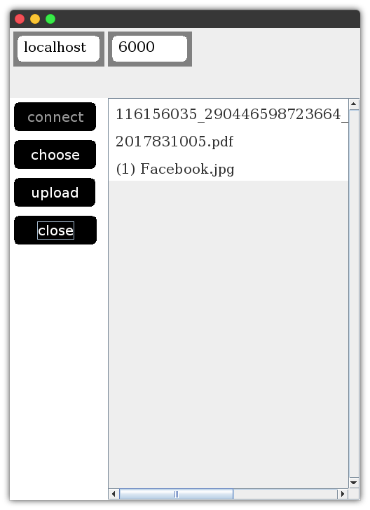
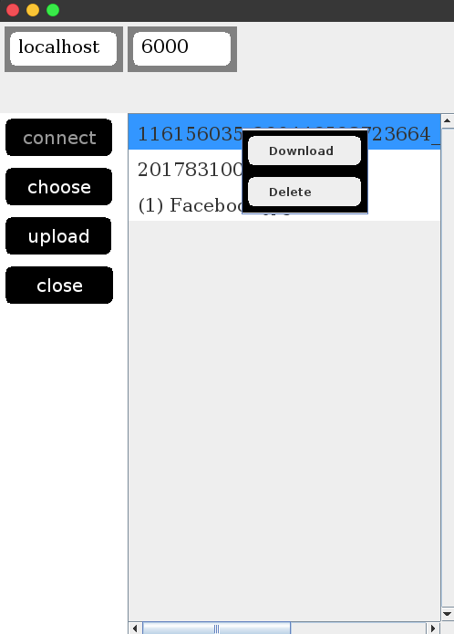
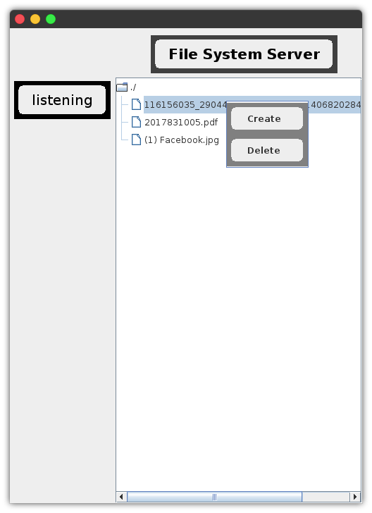

# File-System-Server

The project is about sharing file between two devices using socket. Here one device is Client and another device is Server. At first start the Server program 
then it Start ServerSocket and start listening on port 6000(you can change form code). Then Client program should be run which cunnecct with the server, Client 
socket connect with ServerSocket by ServerSocket's Ip address and Port number on which it's listening.

After connection Client can upload file to Server, download from Server, delete file from server by presssing buttons.

# Client program images

# First view after starting Client program

# Second view after connecting with Server

# Onclick Pop Up menu

# Server Program image

